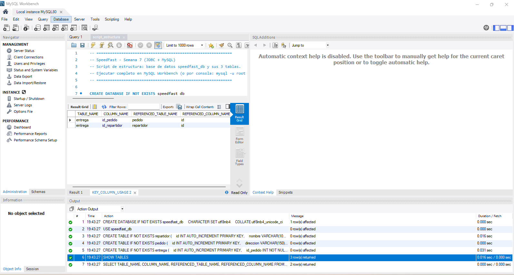
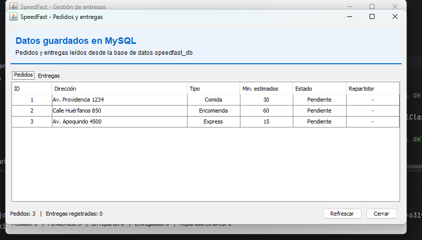
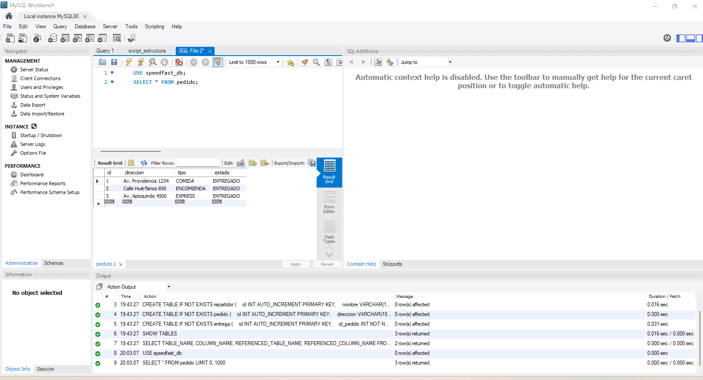
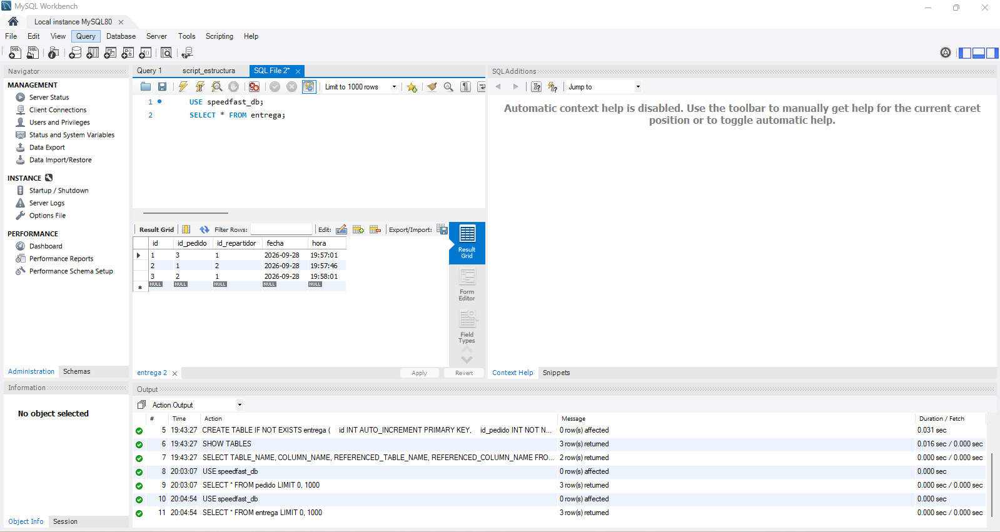
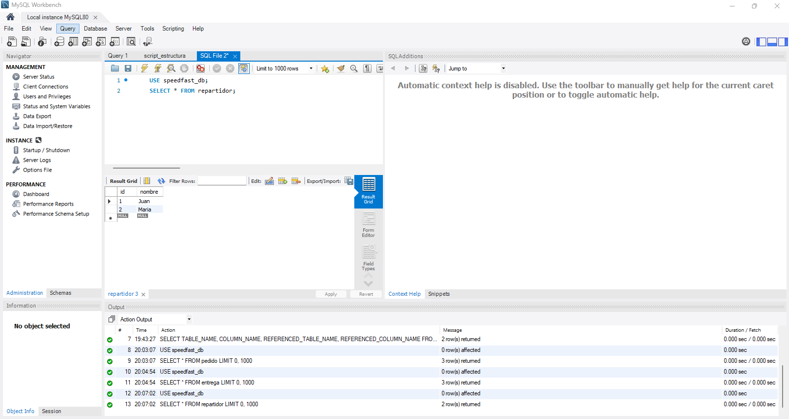

# SpeedFast — Semana 7: JDBC y base de datos MySQL

**Asignatura:** Desarrollo Orientado a Objetos II (PRY2203) — Duoc UC
**Actividad formativa:** Conectando aplicaciones Java con bases de datos mediante JDBC (IL7)
**Estudiante:** Rodolfo Delgado

Aplicación de escritorio Java Swing para la empresa de reparto SpeedFast. En la semana 6 los datos
vivían en listas en memoria; ahora **los pedidos, repartidores y entregas se guardan en MySQL**
usando JDBC (`DriverManager`, `PreparedStatement`, `ResultSet`).

## Requisitos

- JDK 17 o superior
- IntelliJ IDEA (el proyecto es Maven: se abre con *File → Open* sobre la carpeta o el `pom.xml`)
- MySQL Server 8 y MySQL Workbench (`localhost:3306`)
- El conector JDBC se descarga solo con Maven: `mysql-connector-j 9.4.0` (ver `pom.xml`); JUnit 5 también, solo para las pruebas

## Cómo ejecutar

1. **Crear la base de datos.** En MySQL Workbench abrir `bd/script_estructura.sql` y ejecutarlo
   completo (crea `speedfast_db` y las tablas `repartidor`, `pedido`, `entrega`).
   *Opcional:* `bd/datos_prueba.sql` inserta 3 repartidores y 3 pedidos de ejemplo.
2. **Configurar el acceso.** Copiar `db.properties.example` como `db.properties` (junto al `pom.xml`)
   y ajustar los tres datos de la conexión (ver [Configuración de la conexión](#configuración-de-la-conexión)).
   Este archivo no se sube a GitHub (`.gitignore`). Sin `db.properties` se usa
   `jdbc:mysql://localhost:3306/speedfast_db`, usuario `root` y sin contraseña.
3. **Abrir en IntelliJ**, esperar a que Maven descargue las dependencias (*Reload All Maven Projects*
   si hace falta) y ejecutar `src/main/java/main/Main.java`.

Si la conexión falla, al abrir aparece un aviso con la causa (contraseña incorrecta, base inexistente,
servicio MySQL apagado) y la aplicación permite reintentar cuando MySQL esté disponible.

## Configuración de la conexión

Toda la conexión se define en `db.properties`, **no en el código fuente**: cambiar de servidor, de usuario,
de base de datos o de contraseña no obliga a recompilar. `ConexionBD` lee las tres claves:

```properties
db.url=jdbc:mysql://localhost:3306/speedfast_db
db.user=root
db.password=tu_contraseña
```

| Clave | Para qué sirve | Valor por defecto si falta |
|-------|----------------|----------------------------|
| `db.url` | Servidor, puerto y base de datos | `jdbc:mysql://localhost:3306/speedfast_db` |
| `db.user` | Usuario de MySQL | `root` |
| `db.password` | Contraseña de ese usuario | (vacía) |

### Archivos que Git no sube (`.gitignore`)

El `.gitignore` deja fuera del repositorio todo lo que es local o secreto. Cada persona que clone el proyecto
crea los suyos a partir de las plantillas `*.example`, que sí están en GitHub:

| Archivo | ¿Se sube? | Para qué es |
|---------|-----------|-------------|
| `db.properties` | No (`.gitignore`) | Conexión real a `speedfast_db`, con tu contraseña |
| `db-test.properties` | No (`.gitignore`) | Conexión a `speedfast_test` para las pruebas unitarias, con tu contraseña |
| `db.properties.example` | Sí | Plantilla de `db.properties` |
| `db-test.properties.example` | Sí | Plantilla de `db-test.properties` |
| `target/`, `out/`, `*.class` | No | Salidas de compilación |
| `.idea/workspace.xml`, `.idea/shelf/` | No | Configuración local de IntelliJ |

Regla práctica: **nunca escribir una contraseña real en un archivo que sí se sube**. Si `db.properties`
aparece en `git status` como archivo nuevo, algo está mal con el `.gitignore`.

## Modelo de datos

```
repartidor (id PK, nombre)
pedido     (id PK, direccion, tipo, estado)        tipo: COMIDA | ENCOMIENDA | EXPRESS
                                                   estado: PENDIENTE | EN_REPARTO | ENTREGADO
entrega    (id PK, id_pedido FK -> pedido.id, id_repartidor FK -> repartidor.id, fecha, hora)
```

Un repartidor puede hacer muchas entregas y un pedido puede tener una o varias (por ejemplo, si una
entrega queda interrumpida y se vuelve a asignar). Los IDs son `AUTO_INCREMENT`: los genera MySQL.

## Estructura del proyecto

```
SpeedFast-Semana7/
├── pom.xml                      mysql-connector-j (conexión) y JUnit 5 (pruebas)
├── db.properties.example        plantilla de conexión: url, usuario y contraseña (db.properties queda fuera de Git)
├── db-test.properties.example   plantilla de conexión para las pruebas (db-test.properties queda fuera de Git)
├── bd/
│   ├── script_estructura.sql    crea speedfast_db y las 3 tablas
│   ├── script_estructura_test.sql  crea speedfast_test (misma estructura, solo para las pruebas)
│   └── datos_prueba.sql         datos de ejemplo (opcional)
├── src/test/java/dao/           pruebas unitarias: PedidoDAOTest, RepartidorDAOTest, EntregaDAOTest, ConexionBDTest
└── src/main/java/
    ├── main/         Main                        comprueba la conexión y abre VentanaPrincipal
    ├── modelo/       Pedido (abstracta), PedidoComida, PedidoEncomienda, PedidoExpress,
    │                 Repartidor, Entrega, TipoPedido, EstadoPedido
    ├── dao/          ConexionBD, PedidoDAO, RepartidorDAO, EntregaDAO, DAOException
    ├── controlador/  ControladorPedidos          valida, llama a los DAO y avisa a las ventanas
    ├── tareas/       TareaEntrega (Runnable)     simula el recorrido en un hilo (semanas 4 y 5)
    └── vista/        VentanaPrincipal, VentanaRegistroPedido, VentanaRepartidores,
                      VentanaListaPedidos, VentanaAsignarRepartidor, Estilo
```

## Capa JDBC

| Clase | Qué hace |
|-------|----------|
| `ConexionBD` | `conectar()` abre la conexión con `DriverManager.getConnection`. `probarConexion()` usa `try-catch-finally` y cierra la conexión en el `finally`. `describirError()` traduce los códigos de MySQL a mensajes claros. Lee `db.url`, `db.user` y `db.password` de `db.properties`. |
| `PedidoDAO` | `guardar(Pedido)` (INSERT con `PreparedStatement` y clave generada), `listarTodos()` (SELECT con `ResultSet` y LEFT JOIN al repartidor), `actualizarEstado`, `contarPorEstado` (GROUP BY), `reiniciarEntregasInterrumpidas`. |
| `RepartidorDAO` | `guardar(Repartidor)` y `listarTodos()` que devuelve `List<Repartidor>` recorriendo un `ResultSet`. |
| `EntregaDAO` | `guardar(Entrega)` registra la relación pedido–repartidor con fecha y hora; `listarTodas()` hace un JOIN con pedido y repartidor. |

Buenas prácticas aplicadas: todas las consultas usan parámetros `?` (sin concatenar texto, así se evita la
inyección SQL), los recursos (`Connection`, `PreparedStatement`, `ResultSet`) se cierran con
`try-with-resources`, y los errores `SQLException` se capturan en el DAO y se relanzan como `DAOException`
con un mensaje que la ventana muestra en un `JOptionPane`.

## Ventanas conectadas a la base de datos

| Ventana | Qué hace con MySQL |
|---------|--------------------|
| Registrar pedido | Dirección + tipo (`JComboBox`) → `INSERT` en `pedido`; el ID lo genera MySQL. |
| Repartidores | Formulario → `INSERT` en `repartidor`; `JTable` con el `SELECT` de todos los repartidores. |
| Listar pedidos y entregas | Dos `JTable` en pestañas: pedidos (con su repartidor) y historial de entregas. Se recargan al cambiar los datos. |
| Asignar repartidor | Combos con pedidos pendientes (leídos de MySQL) y repartidores libres. Al iniciar: `pedido.estado = EN_REPARTO` + `INSERT` en `entrega`; al terminar el hilo: `estado = ENTREGADO`. |
| Principal | Bitácora de actividad y resumen de pedidos por estado (consulta con `GROUP BY`). |

Los datos quedan guardados: al cerrar y volver a abrir la aplicación los pedidos, repartidores y entregas
siguen ahí. Si la aplicación se cierra con una entrega en curso, al reiniciar ese pedido vuelve a
`PENDIENTE` y puede asignarse de nuevo (queda registrado como otro intento en `entrega`).

## Prueba rápida

1. Ejecutar `script_estructura.sql` y abrir la aplicación.
2. *Repartidores* → guardar `Juan` y `María`; aparecen en la tabla con su ID.
3. *Registrar pedido* → guardar un pedido de cada tipo.
4. *Listar pedidos y entregas* → los 3 pedidos aparecen como *Pendiente*.
5. *Asignar repartidor* → elegir pedido y repartidor → *Iniciar entrega*. En la tabla pasa a *En reparto* y,
   pocos segundos después, a *Entregado* (Express 1,5 s, Comida 3 s, Encomienda 6 s); la pestaña *Entregas*
   muestra la fecha y hora.
6. Cerrar y abrir de nuevo la aplicación: los datos siguen en MySQL. También se pueden ver en Workbench con
   `SELECT * FROM pedido;` y `SELECT * FROM entrega;`.

## Pruebas unitarias de los DAO

Además de probar a mano desde la interfaz, los DAO tienen pruebas automáticas con JUnit 5 (inserción, consulta,
actualización, claves foráneas y manejo de errores). Usan una **base de datos exclusiva para pruebas**,
`speedfast_test`, para no tocar los datos reales de `speedfast_db`.

1. Ejecutar `bd/script_estructura_test.sql` en MySQL Workbench (crea `speedfast_test` con las 3 tablas).
2. Copiar `db-test.properties.example` como `db-test.properties` y escribir la contraseña.
3. Ejecutar `mvn test` (o, en IntelliJ, clic derecho sobre `src/test/java` → *Run All Tests*).

Cada test parte con las tablas vacías, así que no dependen del orden ni de datos previos. Como las pruebas
borran filas, solo se ejecutan si la base conectada se llama `*_test`: si `db-test.properties` falta o apunta a
otra base, los tests de los DAO se **omiten** con un aviso en la consola (no se borra nada y `mvn package`
sigue compilando sin errores).

| Clase de prueba | Qué comprueba |
|-----------------|---------------|
| `PedidoDAOTest` | `guardar` asigna ID; `listarTodos` reconstruye tipo y estado; `actualizarEstado`; repartidor de la última entrega (LEFT JOIN); `reiniciarEntregasInterrumpidas`; `contarPorEstado` (GROUP BY); un texto con SQL malicioso se guarda como texto (sin inyección) |
| `RepartidorDAOTest` | `guardar` asigna ID; `listarTodos` ordenado y vacío; tildes y eñes; nombre más largo que la columna lanza `DAOException` |
| `EntregaDAOTest` | `guardar` asigna ID; `listarTodas` con JOIN (fecha, hora, dirección, repartidor) y orden; pedido o repartidor inexistente viola la clave foránea y lanza `DAOException` |
| `ConexionBDTest` | `describirError` traduce los códigos 1045, 1049, 1146 y los errores de conexión (no necesita base de datos) |

## Continuidad con semanas anteriores

| Semana | Lo que se reutiliza aquí |
|--------|--------------------------|
| 2–4 | Jerarquía `Pedido` abstracta con `PedidoComida`, `PedidoEncomienda`, `PedidoExpress` y `calcularTiempoEntrega()` |
| 4–5 | `EstadoPedido`, cambios de estado `synchronized`, repartidores que entregan en un hilo (`TareaEntrega`) |
| 6 | Interfaz Swing con MVC, observadores y `JTable` con `DefaultTableModel` |

## Evidencias de funcionamiento

Capturas en la carpeta `evidencias/` (MySQL Workbench y la aplicación):

1. Script de estructura ejecutado: 3 tablas y 2 claves foráneas en `entrega`.

   

2. `JTable` con los pedidos leídos desde MySQL (estado inicial *Pendiente*).

   

3. `SELECT * FROM pedido;` después de las entregas (todos `ENTREGADO`).

   

4. `SELECT * FROM entrega;` con la relación pedido–repartidor, fecha y hora.

   

5. `SELECT * FROM repartidor;` con los repartidores registrados desde la interfaz.

   
